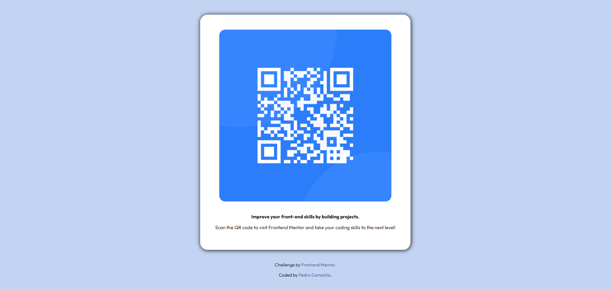

# Welcome! 👋

# Frontend Mentor - QR code component solution

This is a solution to the [QR code component challenge on Frontend Mentor](https://www.frontendmentor.io/challenges/qr-code-component-iux_sIO_H). 

Using only HTML and CSS, I managed to create a replica of the project. I decided to add a couple of things to make it slightly different than the original.

[Frontend Mentor](https://www.frontendmentor.io) challenges help you improve your coding skills by building realistic projects.

**To do this challenge, you need a basic understanding of HTML and CSS.**

## The challenge

Your challenge is to build out this QR code component and get it looking as close to the design as possible.

You can use any tools you like to help you complete the challenge. So if you've got something you'd like to practice, feel free to give it a go.

# Frontend Mentor - QR code component solution

This is a solution to the [QR code component challenge on Frontend Mentor](https://www.frontendmentor.io/challenges/qr-code-component-iux_sIO_H). 

Using only HTML and CSS, I managed to create a replica of the project. I decided to add a couple of things to make it slightly different than the original.

## Overview

### Screenshot

   

Right above is a screen shot to my solution. 

Frontend Mentor's solution is under the design folder/desktop-design.jpeg.

**Note: Delete this note and the paragraphs above when you add your screenshot. If you prefer not to add a screenshot, feel free to remove this entire section.**

## My process

So, to begin this projcet, I ndecided to break down each element I saw into different sections and organize it accordingly. 

Once, I had it organized, it was time for me to begin the project. I first started with HTML. Once it was how I wanted/needed, I began the styling using CSS. Thanks to Frontend Mentor, they were able to provide a style guide with the fonts and colors. 

The CSS portion of is always a challenge. Centering a div is always a complicated thing for me but, I made it and completed it. 

### What I learned

What I learned from this project is how to properly size a picture as well as centering a huge div container in order to center the entire project. It was a fun challenge overall.

### Continued development

In the future, I would love to continue styling. CSS, I think, is my weaker area between HTML and CSS. Media quieries is still new to me so practice makes perfect. 

**Note: Delete this note and the content within this section and replace with your own plans for continued development.**

**Note: Delete this note and replace the list above with resources that helped you during the challenge. These could come in handy for anyone viewing your solution or for yourself when you look back on this project in the future.**

## Author

All created by Pedro Camacho.
